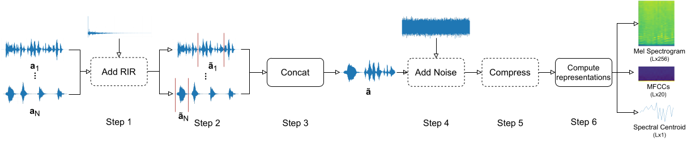
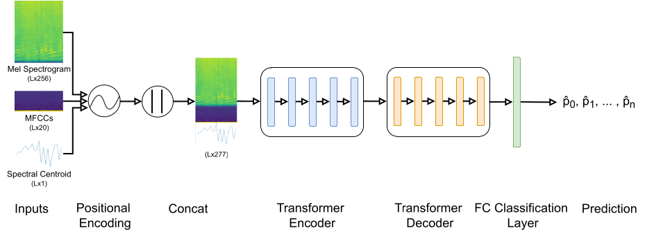

# Towards Unconstrained Audio Splicing Detection and Localization with Neural Networks
This repository contains the code to generate the dataset used for the paper 
**Denise Moussa, Germans Hirsch, Christian Riess. Towards Unconstrained Audio Splicing Detection and Localization with Neural Networks, 2022**.
accepted to [MMForWILD](https://iplab.dmi.unict.it/mmforwild22/) and currently available on [arXiv](https://arxiv.org/abs/2207.14682).
If you use this repository for your research, please cite our work.



## Pretrained Models
[Here](https://faui1-files.cs.fau.de/public/mmsec/moussa/2022-MMFORWILD/trained_models/) you can download our pretrained pytorch models for our experiments specified in the [paper](https://arxiv.org/abs/2207.14682).

## Project organization
Folders and files are organized as follows.

    .
    ├── data                                # Data folder
    │   ├── custom_noise                    # Realnoise data
    │   ├── raw_speech                      # ACE and HiFi TTS speech audio recordings
    │   ├── prepared                        # Prepared ACE and HiFi TTS audio samples
    │   └── rir          		            # Collection of RIRs
    │       ├── others_pra                  # RIRs generated using `generate_rir_dataset.py`
    │       ├── paper_ACE                   # Selected RIRs from ACE Corpus used in the paper
    │       └── paper_pra                   # Selected RIRs from `pyroomacoustics` used in the paper
    ├── configs                             # Parameters for model and data generation
    │   ├── data                            # Parameters for data generation
    │   └── model                           # Parameters for model generation
    ├── transformer                         # Transformer code
    │   ├── dataprep.py                     # Helper functions
    │   ├── datset.py                       # Dataset class used for traning and testing
    │   ├── s2s_evaluation.py               # Transformer evaluation code
    │   ├── s2s_transformer_m.py            # Multiple inputs transformer
    │   └── s2s_transformer.py              # Single input transformer
    ├── datasets                            # Contains generated datasets which are used for training and testing
    ├── models                              # Contains generated models and predictions
    ├── outputs                             # Contains generated evaluations
    ├── 00_prepare_wavs.py                  # Preprocesses wavs: applies all RIRs to all audio recordings
    ├── 01_create_dictionaries.py           # Locates splicing positions and generates dataset dictionaries
    ├── 02_create_datasets.py               # Uses the dictionaries to generate input data
    ├── 03_train_transformer.py             # Transformer training and inference
    ├── 04_evaluate_results.py              # Calculates accuracy, jaccard, recall
    ├── environment.yml                     # Conda environment file
    └── README.md

## Getting started

### Prerequisites
- Install [conda](https://docs.conda.io/en/latest/miniconda.html)
- Create the `mmforwild2022` environment with *environment.yml*
```bash
$ conda env create -f environment.yml
$ conda activate mmforwild2022
```
- Download speech audio tracks and rirs from [this link](https://faui1-files.cs.fau.de/public/mmsec/moussa/2022-MMFORWILD/MMForWILD2022_Data.zip) into the `data` folder


### Parameters configuration (optional)
The folder `configs` contains files used to generate datasets and models.
To generate a specific dataset or model, it is possible to change some parameters.

The parameters of interest for data generation are
- `rir_file_*` and `speaker_file_*`: lists of rirs and audio samples used to generate datasets.
- `snr_db_*` and `compressions_*`: used for noise and compressions.
- `dataset_size_*`: number of generated samples for each dataset.

The parameters of interest for model generation are
- `num_encoder_layers` and `num_decoder_layers`: number of encoder/decoder layers
- `dmodel` and `nhead` in `enc_args_list`: used for encoder parametrization

### Generate reverberated speech
To generate reverberated speech tracks used for training and testing you have to run the script `00_prepare_wavs.py` as it follows
```bash
$ python 00_prepare_wavs.py
```
This will populate the `prepared` folder with the generated audio files.

### Generate dataset dictionaries
Dataset and splicing position dictionaries should be generated with the script `01_create_dictionaries.py` as next. These dictionaries are used for generating actual datasets
```bash
$ python 01_create_dictionaries.py
```
This will populate the `datasets` folder with the generated json files.

### Generate datasets
To generate datasets used for training and testing you have to run the script `02_create_datasets.py`
```bash
$ python 02_create_datasets.py
```
This will populate the `datasets` folder with the generated pickle files.

### Generate model and predictions
Model training and prediction generation is done with the script `03_train_transformer.py`
```bash
$ python 03_train_transformer.py
```
This will populate the `models` folder with the generated model and/or prediction files. You can also use our [pretrained models](https://faui1-files.cs.fau.de/public/mmsec/moussa/2022-MMFORWILD/trained_models/).


### Generate evaluations
Evaluations are calculated from predictions by using `04_evaluate_results.py`
```bash
$ python 04_evaluate_results.py
```
This will populate the `outputs` folder with the generated evaluation files.

## References
- [ACE Corpus](http://www.ee.ic.ac.uk/naylor/ACEweb/)
- [HiFi TTS Corpus](http://www.openslr.org/109/)
